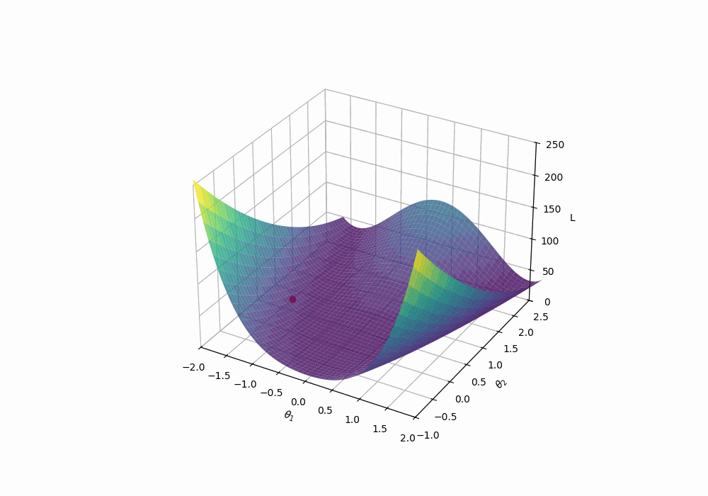

Gradient descent is a fundamental algorithm used for optimizing parameters in machine learning models. Let's learn how it works and how it needs to be adapted to machine learning tasks.
I recommend watching the 3Blue1Brown video on gradient descent:

<iframe width="420" height="315" src="https://www.youtube.com/embed/IHZwWFHWa-w" frameborder="0"> </iframe>


## Gradient descent

Imagine you're hiking down a mountain (representing high error/loss) in foggy weather. Your goal is to reach the lowest point (the minimum value of the loss function). Gradient descent helps guide each step you take based on the steepness of the slope at your current position.

The essence of gradient descent is to adjust variables to minimize a loss function $$ L(\mathbf{w}) $$. Each variable update moves against the gradient's direction (i.e., downhill).


> Generated with matplotlib

The formula for updating parameters $$\mathbf{w}$$ using gradient descent is:

$$
\mathbf{w}^{(t+1)} = \mathbf{w}^{(t)} - \gamma \cdot \frac{\partial L}{\partial \mathbf{w}}
$$

Where:
- $$\mathbf{w}$$ are the parameters we want to optimize.
- $$\gamma$$ is the learning rate, controlling the size of each update step.
- $$\frac{\partial L}{\partial \mathbf{w}}$$ is the derivative of the loss function with respect to the parameters, indicating the slope at the current position. Please note that this is a vector when $$\mathbf{w}$$ is multi-dimensional.

Please note that the learning rate (aka step size) is an essential hyperparameter, similar to our hiking example, we know the direction where to go to, but have no idea how long we should go.

## Generalized Loss Function

In machine learning, a generalized loss function is often expressed as the sum of individual error terms over the entire training set:

$$
L(\mathbf{w}) = \frac{1}{n} \sum_{i=1}^{n} \ell(y_i, f(\mathbf{x}^{(i)}; \mathbf{w})) 
$$

Here:
- $$ \ell(\cdot, \cdot) $$ is a specified error metric, such as squared error.
- $$ f(\mathbf{x}^{(i)}; \mathbf{w}) $$ represents the model's prediction for input $$ \mathbf{x}^{(i)} $$.
- $$ y_i $$ is the actual target value for instance $$ i $$.

A common choice for $$\ell$$ in regression is the squared error which we already
covered when talking about linear models:

$$
L(\mathbf{w}) = \frac{1}{n} \sum_{i=1}^{n} (y_i - f(\mathbf{x}^{(i)}; \mathbf{w}))^2 
$$

## Applying Gradient Descent to Loss Functions

Let's minimize this loss function by gradient descent, which iteratively updates model parameters by moving them in the negative direction of the gradient.
We bascially need the derivatives of the loss function:

$$
\begin{align}
\frac{\partial L}{\partial \mathbf{w}} = \nabla_{\mathbf{w}} L &= \frac{1}{n} \sum_{i=1}^{n} \frac{\partial \ell}{\partial \mathbf{w}}(y_i, f(\mathbf{x}^{(i)}; \mathbf{w})) 
\end{align}
$$

Due to the linearity of the gradient operation, computing the derivatives can be done
by averaging all individual derivatives of $\ell$ for each training example.

## From Gradient Descent to Stochastic Gradient Descent

When datasets are large, computing gradients over the entire dataset becomes computationally expensive. This leads to **Stochastic Gradient Descent (SGD)**, which updates parameters using individual examples or small batches.

Standard SGD uses a single data point $$(\mathbf{x}^{(i)}, y_i)$$ at a time for updates:

$$
w^{(t+1)}_j = w^{(t)}_j - \gamma \frac{\partial \ell}{\partial w_j} (y_i, f(\mathbf{x}^{(i)}; \mathbf{w}))
$$

SGD therefore can be seen as an approximation of gradient descent, since it **approximates** the real gradient, which is **the average of all individual loss gradients with a single random example**.
The advantage of SGD includes faster iterations and often better convergence properties due to its noisy updates that can escape local minima. However it can be also extremely instable.

Let's look at some implementation for a linear regression example:

```python
import numpy as np

# Sample data generation
np.random.seed(42)
X = np.random.rand(100, 1) * 10
y = 5 * X.squeeze() + 7 + np.random.randn(100)

# Initialize parameters
w = np.random.randn()
b = np.random.randn()
learning_rate = 0.01

# SGD loop
for epoch in range(5):  # Number of epochs
    for i in range(X.shape[0]):  # Iterate through samples
        x_i = X[i]
        y_i = y[i]
        
        # Predicted output
        y_pred = w * x_i + b
        
        # Calculate gradients
        dw = -2 * (y_i - y_pred) * x_i
        db = -2 * (y_i - y_pred)
        
        # Update weights and biases
        w -= learning_rate * dw
        b -= learning_rate * db
        
        if i % 10 == 0:  # Print progress every 10 samples
            print(f"Epoch {epoch+1}, Sample {i+1}, Loss: {(y_i - y_pred) ** 2:.4f}")

print(f"Trained weight: {w}, Trained bias: {b}")
```

But wait, can't we simply use pytorch to compute gradients and make our life easier:

```python
import torch

torch.manual_seed(0)

# Generate synthetic data
X = torch.rand(100, 1) * 10  # Features
y = 2 * X + 3 + torch.randn(100, 1)  # Labels with noise
```

Our task is to adjust the model to fit the data points as closely as possible by minimizing the loss, which is the difference between predicted and actual values.

```python
# Define a simple linear model
model = torch.nn.Linear(1, 1)

# Use Mean Squared Error (MSE) as our Loss Function
criterion = torch.nn.MSELoss()
optimizer = torch.optim.SGD(model.parameters(), lr=0.01)

print("Initial Model Parameters:", list(model.parameters()))
```

We'll update the model weights one sample at a time, demonstrating greater speed but variable path consistency.

```python
num_epochs = 5

for epoch in range(num_epochs):
    for i in range(len(X)):
        optimizer.zero_grad()  # Clear gradients from previous iteration

        output = model(X[i].view(1, -1))  # Make prediction
        loss = criterion(output, y[i].view(-1))  # Calculate loss
        
        loss.backward()  # Compute gradients
        optimizer.step()  # Update weights

        if (i+1) % 10 == 0:
            print(f"Epoch [{epoch+1}/{num_epochs}], Sample [{i+1}/{len(X)}], Loss: {loss.item():.4f}")

print("Model Parameters after SGD:", list(model.parameters()))
```

Ok, there is quite a lot to comprehend, here are some hints to might help you:
1. ``torch.nn.Linear`` defines a linear one-dimensional model. The parameters ``(1,1)`` indicate that the model has 1 input and 1 output. The model also includes a bias term (which could be deactivated with ``bias=False``)
2. ``torch.nn.MSELoss`` is the mean squared error loss used for $$\ell$$, which is later executed as ``criterion`` taking the model output and the label
3. ``loss.backward()`` computes all involved gradients of the model wrt. to the loss
4. ``optimizer.step()`` uses the these gradients to perform an optimization step of SGD
5. The example also involves the term **epoch**. We reached one epoch when the model has seen all training examples and has used all training examples to perform individual model updates. 

## Mini-Batch Gradient Descent in pytorch

I guess you can imagine that SGD with a single example is very instable in a lot of cases.
What can you expect when you approximate an average of samples with a random sample?
A straightforward idea is to use small groups of examples, so called batches.
By processing small groups of samples, we achieve a compromise between speed and stability.

```python
from torch.utils.data import DataLoader, TensorDataset

batch_size = 10
dataset = TensorDataset(X, y)
data_loader = DataLoader(dataset, batch_size=batch_size, shuffle=True)

model = torch.nn.Linear(1, 1)  # Reinitialize model
optimizer = torch.optim.SGD(model.parameters(), lr=0.01)

for epoch in range(num_epochs):
    for batch_X, batch_y in data_loader:
        optimizer.zero_grad()  # Reset gradients

        outputs = model(batch_X)  # Predict
        loss = criterion(outputs, batch_y)  # Calculate loss

        loss.backward()  # Backpropagate
        optimizer.step()  # Adjust weights

    print(f"Epoch [{epoch+1}/{num_epochs}], Loss: {loss.item():.4f}")

print("Model Parameters after Mini-Batch Gradient Descent:", list(model.parameters()))
```

Mini-Batch SGD (often just referred to SGD) is also very benefial when there is a memory
limit during the optimization. You could simple choose a batch size that allows the training examples that have been randomly chosen in an iteration to fit into the GPU memory - including their immediate tensors and gradients.