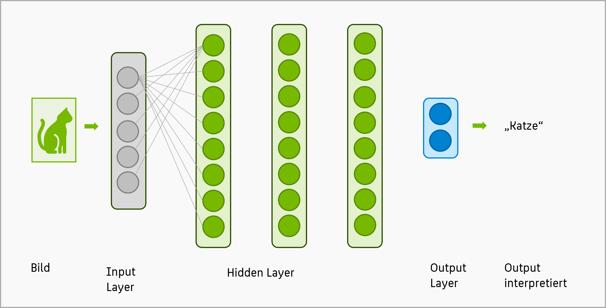
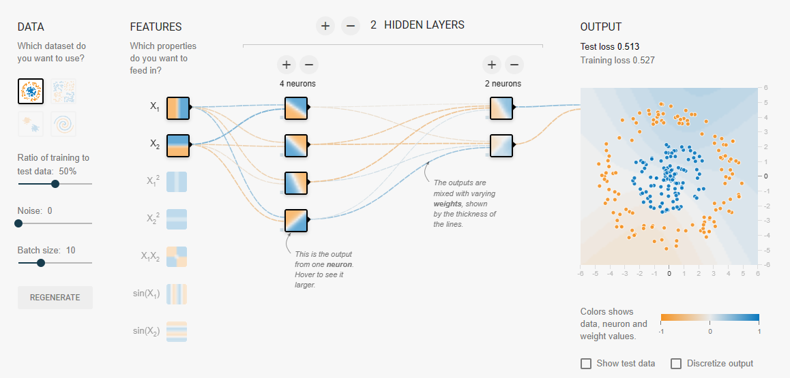
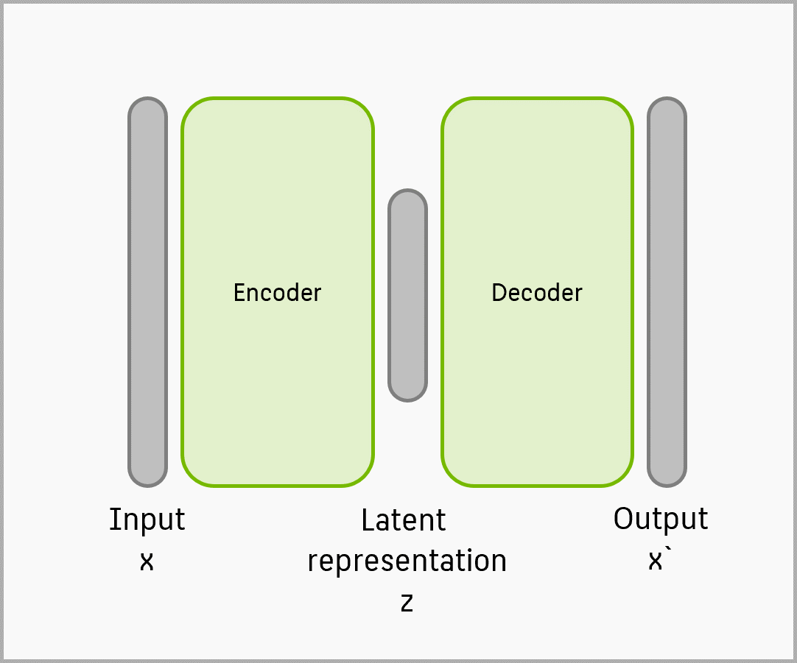

**Künstliche Intelligenz** (KI) ist ein umfangreiches Forschungs- und Arbeitsfeld, dessen Definition und Bedeutungsumfang in den letzten 50 Jahren immer wieder starken Veränderungen unterlag. Aktuell kann man KI am ehesten verstehen als Gesamtheit aller Methoden, Systeme und Forschungsansätze, die dem Ziel der Automatisierung menschlichen Verhaltens und menschlicher Aufgaben dienen.  
**Maschinelles Lernen** (ML) bezeichnet innerhalb der KI eine umfangreiche Sammlung von insbesondere statistischen Methoden, welche Daten verarbeiten und daraus Modelle entwickeln. Anhand dieser Modelle können Vorhersagen getroffen oder Muster identifiziert werden, sowie Entscheidungen und Automatisierungen vorgenommen werden. 
**Deep Learning** (DL) ist eine besondere Art von Methoden des ML, welche auf dem mathematischen Prinzip von großen neuronalen Netzen basieren.
{: .notice--info}

**Neuronale Netze** sind, formell betrachtet, mathematische Modelle, das heißt große, mathematische Formeln, die auf Basis eines Eingabevektors ein Ergebnis (eine Zahl) ausrechnen. Also für einen Zahlenvektor $\mathbf{x}$ eine Funktion $f(\mathbf{x}) = y$ mit $y\in \mathbb{R}$:

$$y = f(\mathbf{x})$$

Die Magie entsteht, wenn man die Zahlen interpretiert: so könnte $\mathbf{x}$ (= ein **ein**dimensionaler Vektor) ein Bild sein, bei dem alle Farbwerte hintereinander als Zahlen aufgeschrieben werden. Und $y$ (= eine reelle Zahl) wird gerundet und interpretiert als 1 = Katze, 2 = Hund, 3 = Toaster und so weiter. Damit würde diese mathematische Formel einen **Bildklassifikator** implementieren:

Wenig überaschend ist eine mathematische Formel, die dies leisten kann, von hoher Komplexität. Deshalb wird die Formel üblicherweise nicht explizit aufgeschrieben, sondern durch ein Modell graphisch angedeutet: neuronale Netze sind sogenannte **Multi-Layer-Perzeptrons**.

Ein **Perzeptron** ist dabei ein mathematischen Modell, bei dem die Eingabewerte $x$ zuerst mit Gewichten $w$ multipliziert und aufaddiert werden. Das Ergebnis (eine reelle Zahl) wird anschließend mit einer einfachen Aktivierungsfunktion (z.B. sigmoid, tanh) umgewandelt. Das Ergebnis ist der Output des Perzeptrons. 

 

Ein einzelnes Perzeptron bildet damit das einfachste mögliche Neuronale Netz. Tatsächlich werden in neuronalen Netzen aber viele (hunderte, tausende) Perzeptrons neben- und hintereinandergeschaltet. Die folgende Darstellung zeigt ein typisches neuronales Netz - jeder grüne Punkt bezeichnet nun ein Perzeptron. Die Anzahl ist hier nur angedeutet - üblicherweise enthält eine Schicht hunderte von Knoten. Die Verbindungslinien zwischen den Layern deuten an, dass jeder Knoten einer niedriegeren Schicht mit allen Knoten einer höheren Schicht verbunden ist:

Für einfache Bildklassifikationsaufgaben genügen dafür schon 2-3 Layer, die jeweils ein paar hundert Perzeptrons haben. Für anspruchsvollerer Probleme werden aktuell hunderte von Schichten hintereinander geschaltet, was Tausende von Perzeptrons benötigt. Jedes Perzeptron ist damit eine kleine Teil-Funktion in der großen mathematischen Formel, die das neuronale Netzwerk berechnet. Beachten Sie dabei, dass jedes Perzeptron (jede einzelen Teil-Funktion) sich durch einen ganz individuellen Gewichtsvektor $w$ auszeichnet. Damit verfügt die große Funktion des gesamten Netzes über sehr viele solcher $w$-Vektoren und damit über Tausende, vielleicht Millionen von Parametern! 

Wenn Sie möchten, könnnen Sie mit dem [Tensorflow Neural Network Playground](https://playground.tensorflow.org) einmal ausprobieren, wie die Anzahl von Schichten und Knoten darin die Leistungsfähigkeit eines Netzwerkes beeinflusst.

 

Aber wo kommen die Gewichte $w$ im Netzwerk her? Dies ist die Magie des Deep Learnings. Vereinfacht gesagt werden die Parameter in der mathematischen Funktion $f$ zu Beginn mit zufälligen Zahlen belegt. Dies führt dazu, dass die Funktion $f$ des neuronalen Netzes zu Beginn absehbar ein unsinniges Ergebnis berechnet, wenn unser Katzenbild als Input gegeben wird. In sehr komplexen iterativen Algorithmen (die wir hier nicht behandeln) wird nun wieder und wieder ein kleines bisschen an den (vielen!) Gewichten $w$ gedreht, so dass der Output ein *bisschen* korrekter ist (erinnern Sie sich: der Output des Netzes ist eine reelle Zahl). Dies wird unzählige Male wiederholt, mit unzäligen Beispielbildern und ihrem jeweiligen Output, bis die Gewichte schließlich so eingestelt sind, dass das Neuronale Netz den gewünschten Output liefert, d.h. die gewünschte Zielfunktion "gelernt" hat.

Damit beherrschen Sie nun die grundlegende Intuiton neuronaler Netze. Neben unzähligen mathematischen Feinheiten in der obigen Erklärung beschäftigt sich die aktuelle Forschung vor allem damit, welche **Architekturen** von neuronalen Netzen für bestimmte Anwendungsfälle gut geeignet sind. Die Architekturen werden üblicherweise nur anhand ihrere Schichten angedeutet.
{: .notice--info}

Überlegen Sie mal: wofür könnte z.B. ein **Autoencoder** (siehe Bild unten) gut sein? 
{: .notice--task}

 