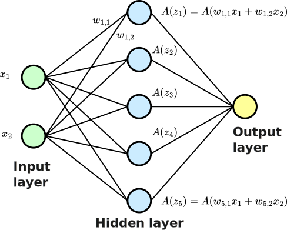

Neural networks are built upon fundamental units often known as neurons, which are inspired by biological neural systems. However, let's avoid the term neurons and rather talk about units instead.
Units form the building blocks of complex architectures capable of modeling intricate patterns and relationships in data. Everything covered in this small lecture is also very well presented in the following 3Blue1Brown video:

<iframe width="420" height="315" src="https://www.youtube.com/embed/aircAruvnKk" frameborder="0"> </iframe>

There is also a great visualization again at [mlu-explain](https://mlu-explain.github.io/neural-networks/).

## A single unit

A classical unit processes inputs to produce an output - nothing more nothing less. 
Each unit receives a feature vector $$ \mathbf{x} = [x_1, x_2, \ldots, x_D] $$
and contains an associated weight vector $$ \mathbf{w} = [w_1, w_2, \ldots, w_D] $$ and a scalar value $$b$$. 
These weights determine the importance of each input dimension in the unit processing.
  
The first step in a neuron's processing involves computing the weighted sum of inputs:

$$
z = \mathbf{w}^T \mathbf{x} + b = \sum_{d=1}^{D} w_d x_d + b
$$

The scalar $$b$$ is the so-called bias term, allowing the model to fit the data more flexibly.
The above description should sound familiar, basically the unit first performs the execution of a linear
model.

A linear model has several advantages, however, to process more complex data, which is not separable
by a single hyperplane, we need to introduce non-linearity essential for networks build from units.

Therefore, the unit passes the result of the linear combination $$z$$ through an activation function $$ A(z) $$. Common activation functions include:

- **Sigmoid**: $$ A(z) = \frac{1}{1 + e^{-z}} $$
- **ReLU (Rectified Linear Unit)**: $$ A(z) = \max(0, z) $$
- **Tanh (Hyperbolic Tangent)**: $$ A(z) = \tanh(z) $$

The result of the activation function is the unit's output.

## Building networks

A single unit is basically just a non-linearly transformed output of a linear model,
but connecting them is where the magic happens. As you can see in the image, you can transform the input
already with multiple units and furthermore you can sequentially connect the units to transform an input multiple times sequentially. This concept leads to **Multi-layer Perceptron (MLP)**,
which are comprised with multiple layers: input layer, hidden layers, and an output layer. Each layer's units perform computations based on outputs from the preceding layer, forming a neural network architecture.

Through stacking layers, multi-layer perceptrons (MLPs) can form intricate decision boundaries, capable of separating data that single-layer models cannot.

According to the [Universal Approximation Theorem](https://en.wikipedia.org/wiki/Universal_approximation_theorem), a feedforward network with at least one hidden layer containing a sufficient number of neurons can approximate any continuous function, thereby addressing non-linear separability effectively.

> Neural network with a hidden layer without bias terms 

### Layers as Transformed Matrix-Vector Multiplication

In the context of neural networks, each layer consists of multiple units that perform computations using both linear models and non-linear transformations. This can be elegantly represented with linear algebra.

We start by combing all weight vectors of a layer into a weight matrix $$\mathbf{W}$$. 
Given $$D$$ inputs and $$M$$ output units, we define:

$$
\mathbf{W} = \begin{bmatrix} 
w_{11} & w_{12} & \cdots & w_{1D} \\ 
w_{21} & w_{22} & \cdots & w_{2D} \\ 
\vdots & \vdots & \ddots & \vdots \\ 
w_{M1} & w_{M2} & \cdots & w_{MD} 
\end{bmatrix}
$$
   
Similarily, all bias values can be combined into a vector $$\mathbf{b}$$:

$$
\mathbf{b} = \begin{bmatrix} b_1 \\ b_2 \\ \vdots \\ b_D \end{bmatrix}
$$

The transformation (without non-linear activation) 
of the input $$\mathbf{x}$$ by the layer can then be expressed by:

$$
\mathbf{z} = \mathbf{W} \mathbf{x} + \mathbf{b}
$$

Once the linear transformation $$\mathbf{z}$$ is computed, each element is passed through a non-linear activation function $$ A(\cdot) $$. This results in the final output of the layer:

$$
  \mathbf{x}' = A(\mathbf{z}) = \begin{bmatrix} A(z_1) \\ A(z_2) \\ \vdots \\ A(z_M) \end{bmatrix}
$$

