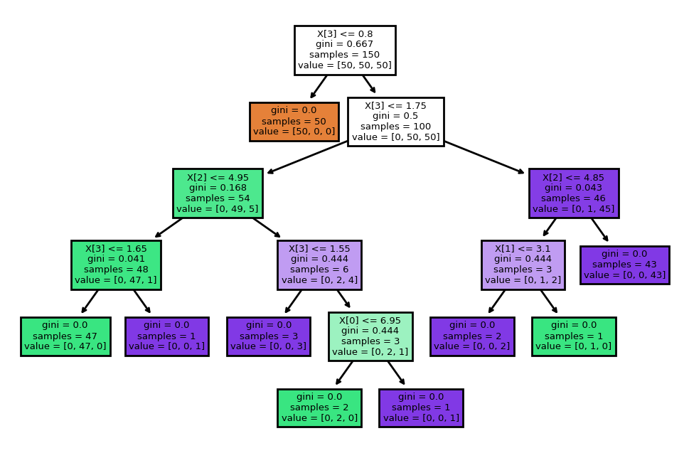

A Decision Tree is a predictive model that maps observations about an item to conclusions regarding the item's target value with sequential decisions. 
A single tree consists of:

1. **Decision Nodes**: Each internal node represents a "test" or decision on an attribute (e.g., whether a person earns more than $50K/year), e.g. $$x_d > \theta$$.
2. **Branches**: Each branch represents the outcome of the test, leading to either another decision node or a leave.
3. **Leaves**: Leaf nodes of the tree represent the final output class (classification) or value (regression).

## Inference using a decision tree


> Example decision tree on the IRIS dataset, image from [wikipedia]
(https://commons.wikimedia.org/wiki/File:Classification_tree_on_iris_dataset.png)

Above image shows a decision tree applied to classification. Performing inference (i.e. predicting the result for an unseen example) is done by traversing the tree from top to bottom. At each internal decision node, the corresponding test is performed and the traversal contains either left or right.

The leaf nodes contain a distribution of probable classes with which the example can be associated with.
The class with highest probability can then be taken as the prediction result.

## ⭐Learning a tree for classification

How do we find a proper tree when provided with data during learning? A
decision tree is build from top to bottom.
The learning starts with the root node and trying to find the test that best splits the data. For
a binary classification task, the best split would be one that splits the training data directly into the two classes. However, this is only a perfect scenario, which can not be directly achieved in non-trivial cases.
We therefore have to measure the quality of a split using certain criteria.

A nice visualization of this process can be found at [mlu-explain](https://mlu-explain.github.io/decision-tree/).

Let $$p_\kappa$$ be the portion of examples belonging to class $$\kappa$$ in the current decision node $$T$$.
The *entropy* measures how impure the set of examples is:

$$H(v) = - \sum_{i=\kappa}^{C} p_\kappa \log(p_\kappa)$$

and has a maximal value for a uniform distribution, i.e. we have an equal number of examples from each class.
We now can compute the so called *information gain*, which is the reduction in entropy after a dataset is split:

$$IG = H(v) - \sum_{v' \;\text{is a subnode of}\; v} P(v') H(v')$$

Where $$H(v')$$ is the entropy of the sub-node $$v'$$ (left or right) and $$P(v')$$ is the proportion of examples in that sub-node relative to the parent node.
For continuous variables, the tree can decide on a threshold value to split the data. For example, a decision node might split based on whether $$x_d \leq \theta$$, where $$\theta$$
 is some threshold. 

The selection process for decisions continues recursively in the sub-nodes until a certain termination criteria is reached.

What are suitable termination criteria you can think of? When should we break up and simply place a leaf node? Discuss and list suitable techniques!
{: .notice--info}

## Example

Here's again an example using `sklearn` to demonstrate fitting a decision tree classifier and visualizing it:

```python
from sklearn.tree import DecisionTreeClassifier, export_text, plot_tree
import matplotlib.pyplot as plt
import numpy as np

# Sample data
X_train = np.array([[2.5, 2.5], [1.0, 1.0], [8.5, 8.5], [7.0, 7.0]])
y_train = np.array([0, 0, 1, 1])
X_test = np.array([[4.0, 4.0]])

# Create and fit Decision Tree model
tree = DecisionTreeClassifier(criterion='gini', max_depth=3, random_state=42)
tree.fit(X_train, y_train)

# Predict class for new data point
y_pred = tree.predict(X_test)
print(f"Predicted class for {X_test}: {y_pred}")

# Visualize the Decision Tree
plt.figure(figsize=(12,8))
plot_tree(tree, feature_names=["Feature 1", "Feature 2"], class_names=["Class 0", "Class 1"], filled=True)
plt.show()

# Print the tree structure in textual format
tree_rules = export_text(tree, feature_names=["Feature 1", "Feature 2"])
print(tree_rules)
```

The `DecisionTreeClassifier` from sklearn has several parameters like `criterion` which specifies the function to measure the quality of a split (`gini` for Gini impurity and `entropy` for information gain). The `max_depth` parameter controls the depth of the tree, helping to avoid overfitting. The method `plot_tree` provides a visual representation of the decision process.
